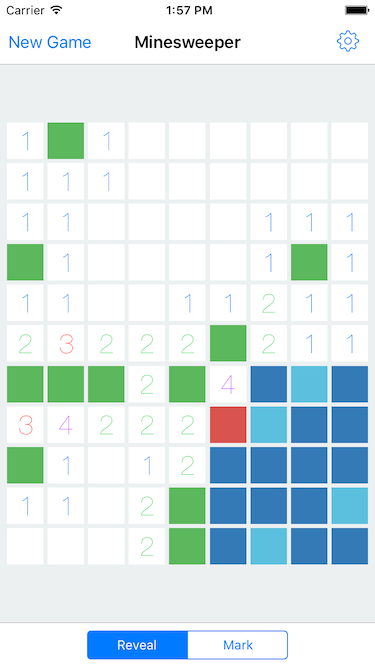

# Minimal Minesweeper for iOS
This minesweeper game is designed to be the simplest in look and use.
Test it for free on the App Store (when the app will be approved) : http://apple.co/1W5Xw2K



# Licence
This source code is on Github for consultation purposes only.
Please do not use or reuse all or fraction of this code in one of your project without receiving an authorization from myself.

Feel free to contact me for it anyway !

Nonetheless, you're free to build this app for YOUR PERSONAL USE ONLY.

# Features
* Allow to play Minesweeper in four levels of difficulty (Easy, Medium, Hard and Insane)
* Game Center integration with leaderboards and achievements
* Flat design using iOS7 color palette.
* Ability to mark mines with long press and/or deep press (Deep Press uses 3DTouch if available, but will work on EVERY devices !)
* Otherwise, mine marking with segmented control
* Statistics consultation
* Fully optimized for iPhone and iPad layouts
* Gameplay optimized for touch environment

# Building
In order to build, first you will need to install dependancies with Cocoapods :

```pod install```

Before building, you'll need to remove Fabrics initialization in `AppDelegate.swift`, and you'll also need to remove the Fabric integration custom script in the Build Phases.

Now, you should be able to build the app and enjoy the app !

# Tests
The core of the game is tested with units tests, which mean the game itself sould always have a correct behavior.

The UI is not tested automatically, but it have been tested manually with a lot of games.
